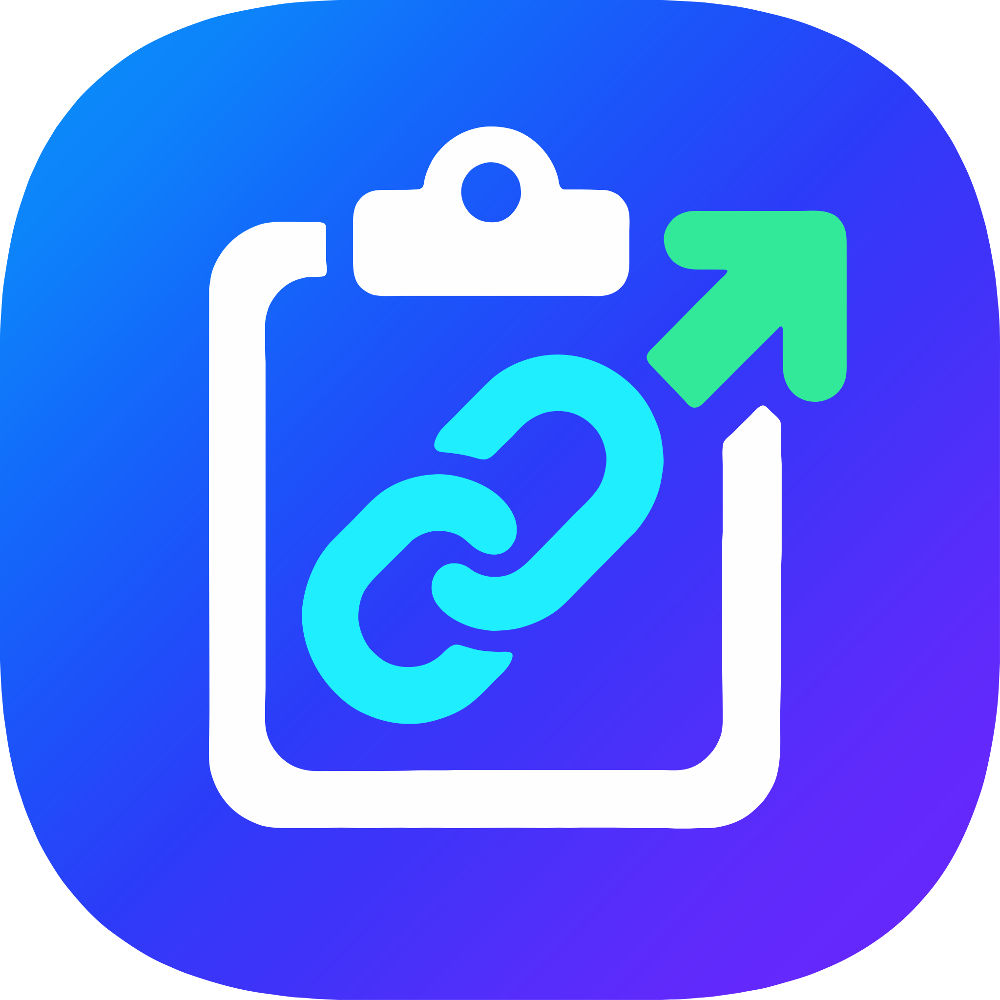

# ClipLink — 剪贴板网址助手

<p align="center">
  
</p>

<p align="center">
  <strong>监测剪贴板中的网址，复制即弹通知，一键用默认浏览器打开。</strong><br>
  基于 Shizuku 实现。
</p>

<p align="center">
  
  
  
  
  
</p>

<!-- 截图：补拍后可在此处插入主界面明暗两版的截图 -->

## 功能

| 功能 | 说明 |
|------|------|
| 后台监测 | Shizuku 可用时事件驱动监听，无轮询、无闪屏 |
| 兜底检测 | Shizuku 未启动时降级为「点通知才检测」，功能不静默失效 |
| 历史记录 | 保存最近 200 条（可调），支持复制、删除、点击打开 |
| 自动打开 | 可选开关，检测到网址后跳过确认直接跳转（默认关闭） |
| 触发条件 | 可选「仅 Wi-Fi」「仅充电」时监测，省电 |
| 忽略域名 | 命中的域名不再提醒 |
| 去重冷却 | 同一链接 3 秒内不重复提醒 |
| 深色模式 | 完整适配 Material 3 明暗两套配色与 edge-to-edge |

## 快速开始

### 1. 准备 Shizuku

ClipLink 依赖 [Shizuku](https://github.com/RikkaApps/Shizuku)（[Releases](https://github.com/RikkaApps/Shizuku/releases)）。
**Android 11 及以上可以完全在手机上启动它，不需要电脑：**

1. 「设置 → 关于手机」连点「版本号」7 次，启用开发者选项
2. 「开发者选项」里打开「USB 调试」和「无线调试」
3. 打开 Shizuku，点「通过无线调试启动」→「配对设备」，把通知里的 6 位配对码填进去
4. 配对完成后点「启动」

> 每次重启手机后 Shizuku 需要重新启动，这是它的机制限制。手机已 root 的话可在
> Shizuku 里开启开机自启，一劳永逸。

### 2. 安装 ClipLink

从 [Releases](../../releases) 下载 APK 安装，或参考下文自行构建。

### 3. 启动监测

打开 ClipLink：授予通知权限（Android 13+ 必需）→ 点「授予 Shizuku 权限」并在弹窗允许
→ 点「开始监测」。状态灯变绿即就绪。

之后在任意应用里复制含网址的内容（例如 `https://github.com/torvalds/linux`），
通知栏会立即弹出「检测到网址」，点「打开」即用系统默认浏览器跳转。

## 权限说明

| 权限 | 用途 |
|------|------|
| `POST_NOTIFICATIONS` | 显示链接提醒（Android 13+ 需运行时授权） |
| `FOREGROUND_SERVICE` / `..._SPECIAL_USE` | 前台服务保活监听器 |
| `ACCESS_NETWORK_STATE` | 判断是否 Wi-Fi（仅「仅 Wi-Fi」模式使用） |
| `moe.shizuku.manager.permission.API_V23` | 请求 Shizuku 授权 |

本应用**不申请**无障碍、悬浮窗、读取日志、后台弹窗等敏感权限。

## 工作原理

```
复制网址
  │
  ├─ 主通道：Shizuku(shell 身份) 注册的 IClipboard 事件监听 ── 复制即触发
  │
  ├─ 保险：5s 低速看门狗轮询（监听失效时提速到 1.5s 承担全部检测）
  │
  └─ 兜底：Shizuku 不可用时，点通知 → 透明 Activity 抢焦点读取
```

三条通道都汇聚到同一个通知流程：提取网址 → 去重冷却 / 忽略域名过滤 → 弹出通知。
实现上的关键决策（手写 Binder 协议、反射调用 `IClipboard`、监听器的 `asInterface`
包装坑、Android 14+ 参数变化、edge-to-edge 与深色模式适配、矢量图标的逆向生成等）
都记录在 **[docs/DESIGN.md](docs/DESIGN.md)**。

## 构建

环境要求：Android Studio（推荐）或 JDK 17+ 与 Android SDK 35。

```bash
git clone https://github.com/BBBBBBBBai/ClipLink.git
cd ClipLink
./gradlew assembleDebug        # 产物：app/build/outputs/apk/debug/app-debug.apk
./gradlew test                 # 单元测试（UrlExtractor 40+ 用例）
```

也可以直接用 Android Studio 打开项目根目录，同步后点运行。

### 正式版签名

签名材料不入库。在项目根目录放一个 `keystore.properties`（已被 `.gitignore` 排除）：

```properties
storeFile=cliplink-release.jks
storePassword=...
keyAlias=...
keyPassword=...
```

再执行 `./gradlew assembleRelease`。文件缺失时 release 退化为未签名包而不是构建
失败——克隆下来仍然能编译，只是打不出可安装的正式包。

## 项目结构

```
app/src/main/java/com/cliplink/
├── ClipLinkApp.kt                 应用入口
├── MainActivity.kt                主界面：状态、权限引导、诊断
├── SettingsActivity.kt            设置：行为开关、忽略域名
├── HistoryActivity.kt             历史记录列表
├── ClipboardMonitorService.kt     前台服务，承载完整事件流
├── ClipboardCheckActivity.kt      兜底：半透明 Activity 抢焦点读取
├── OpenLinkActivity.kt            处理「打开」动作
├── NotificationHelper.kt          通知构建与状态切换
├── UrlExtractor.kt                网址提取与规范化（纯函数）
├── LinkRepository.kt              历史记录持久化
├── Prefs.kt                       设置存储
└── shizuku/
    ├── ClipboardUserService.kt    Shizuku UserService（运行在 shell 身份）
    ├── ShizukuHelper.kt           Shizuku 状态与绑定管理
    └── ClipboardProtocol.kt       手写 Binder 协议
```

## 许可证

[MIT](LICENSE) © 2026 BBBBBBBBai
